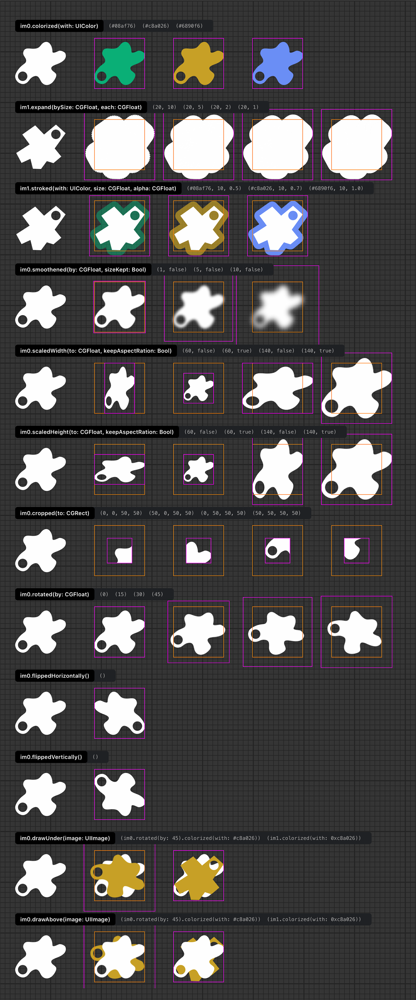

[](https://github.com/herme5/ImageProc/actions/workflows/tests.yml)

## Introduction

ImageProc is a collection of Swift utility methods for PNG image processing through the `UIImage` native API.

Sometimes icons have to be dynamically transformed, adding to the burden of the designer that needs to duplicate its rendered assets (e.g. same icons that have different colors, diferrent sizes...). Nevertheless, remember that static processing and pre-rendering is always better for the energy footprint of your apps.

## Demo



## Installation

ImageProc is a Swift package and requires iOS 15 or later.

In Xcode, use *File ▸ Add Package Dependencies…* and enter `https://gitlab.com/herme5/ImageProc.git`.

Or add it to the dependencies of your own `Package.swift`:

```swift
.package(url: "https://gitlab.com/herme5/ImageProc.git", from: "2.0.0")
```

Then `import ImageProc` where you need it.

Some operations are implemented as Core Image kernels written in Metal, which the package compiles
for you through a build tool plugin. Xcode may ask you to trust and enable that plugin the first
time you build.

## Usage

All methods extend `UIImage` and `UIColor` classes.

```swift
let someImage = UIImage(named: "someImageWithTransparency")!

let someColor = UIColor(value: 0x08af76) // Color can be initialized with its hexadecimal value.
let aBitDarkerColor = someColor.darker(by: 0.1) // RGB component will be decreased by 0.1 to give a darker color.

// Fill the opaque pixels with the given color.
let coloredImage = someImage.colorized(with: someColor) 
let aBitDarkerImage = someImage.colorized(with: aBitDarkerColor) 

```

## Releasing

A git tag *is* the release. The version is not recorded anywhere in the tree — there is no manifest
field to bump — because Swift Package Manager consumers resolve tags straight from the remote. Tags
are bare `X.Y.Z`, with no `v` prefix.

Work happens on `develop` and reaches `master` through a **merge commit**, never a fast-forward, so
that the branch point stays visible in the history:

```sh
git checkout master
git merge --no-ff develop
git push origin master
```

When merging through GitLab instead, the project's merge method must be set to *Merge commit*.

Then create the release:

```sh
./Scripts/bump.sh 2.2.0
```

The script refuses a version that is already tagged, and refuses to run at all until `develop` has
been merged into `master`. Two things worth knowing before running it:

- **It is destructive to `develop`.** It hard-resets `develop` onto `origin/master` and force-pushes
  it, discarding anything that exists only there.
- **It stashes uncommitted changes and never pops them.** Commit your own work first, or recover it
  afterwards with `git stash pop`.

Pushing the tag triggers the `Release` stage in `.gitlab-ci.yml`, which creates the GitLab release
entry. There is nothing to publish beyond that — and nothing depends on it either: Swift Package
Manager resolves the tag, so a release with no entry still installs. That is why 2.0.0 through 2.3.0
went unnoticed without one (see below).

## Continuous integration

**The tests run on GitHub Actions**, in `.github/workflows/tests.yml`: SwiftLint, the test suite on a
simulator, a device build of the package — the kernel is compiled per-SDK, so a simulator build says
nothing about a device one — and a build of the demo app. The simulator is chosen at run time from
whatever the runner image has, rather than named, since that list changes with every image.

They run there because they need macOS and Xcode, and GitHub hosts those runners for public
repositories. The GitLab pipeline used a self-hosted runner that has been unavailable since August
2023: every job from 2.0.0 onwards ended as `stuck_pending_no_matching_runners`, so those versions
were tagged from a commit CI never built, and none of them got a release entry. Nobody noticed,
because a missing entry breaks nothing for consumers.

The workflows are triggered by the **mirror** carrying a push to GitHub, a minute or two after the
push to GitLab — nothing is pushed to GitHub by hand. A tag reaches it the same way.

What is left on GitLab is the `Release` job alone, and it **still needs a runner**: `release-cli` is a
Linux image, so either the shared runners have to be available to the project, or some runner that
can run a container has to pick it up. Until then the tag pipeline keeps failing and the release entry
keeps not being created.

### The GitHub mirror

`github.com/herme5/ImageProc` is a **push mirror of GitLab**, configured in GitLab under *Settings ▸
Repository ▸ Mirroring repositories*. It is not part of this repository, and `bump.sh` does not push
to it: releases reach GitHub because the mirror carries them after the push to GitLab.

It authenticates with an SSH deploy key — GitLab holds the private half, and the public half sits on
GitHub under the repository's *Settings ▸ Deploy keys* with *Allow write access* enabled. A deploy
key does not expire, unlike the access token this used before, which stopped mirroring the moment it
lapsed and did so silently: the release looked complete on GitLab while GitHub stayed several
versions behind. If GitHub falls behind again, that same settings page shows the last attempt and
the error, and a release is only really out once the tag is on both remotes:

```sh
git ls-remote --tags origin "refs/tags/$version"
git ls-remote --tags https://github.com/herme5/ImageProc.git "refs/tags/$version"
```

Push mirrors add and update refs but never delete them, so GitHub carries a few refs GitLab does
not. The tags `1.1.0` and `1.1.1`, and the branch `devops/ssh-test`, predate the move to GitLab and
are **not releases**.
